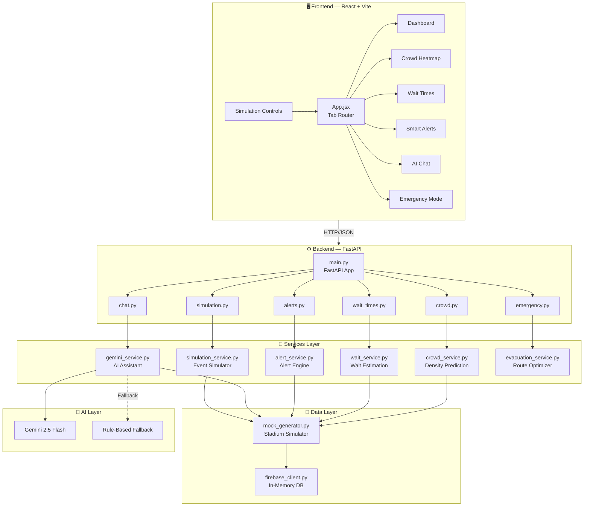
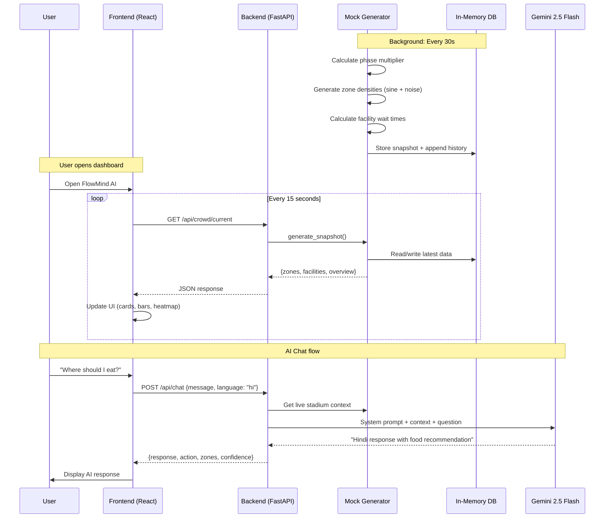
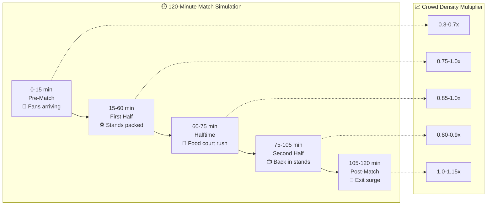

<](https://python.org)
[](https://fastapi.tiangolo.com)
[](https://react.dev)
[](https://vite.dev)
[](https://ai.google.dev)

---

</div>

## 🎯 Problem Statement

Large sports stadiums hosting 50,000+ fans face critical challenges:
- **Crowd congestion** at gates, food courts, and restrooms causes frustration
- **Unpredictable wait times** lead to fans missing parts of the event
- **No real-time navigation** means fans can't find the fastest routes
- **Emergency evacuations** are slow without optimized gate routing

**FlowMind AI** solves this by providing **predictive crowd intelligence** — telling fans not just what's happening *now*, but what will happen in the **next 5–15 minutes**.

---

## 🏗️ System Architecture



---

## 🔄 Data Flow



---

## 📂 Project Structure

```
flowmind-ai/
├── 📄 README.md
├── 📄 .gitignore
│
├── ⚙️ backend/                          # FastAPI Python Backend
│   ├── app/
│   │   ├── main.py                      # App entry + lifespan + CORS
│   │   ├── config.py                    # Pydantic settings (env loading)
│   │   │
│   │   ├── routers/                     # API endpoint handlers
│   │   │   ├── crowd.py                 # /api/crowd/* (3 endpoints)
│   │   │   ├── wait_times.py            # /api/wait-times/* (3 endpoints)
│   │   │   ├── alerts.py                # /api/alerts/* (2 endpoints)
│   │   │   ├── chat.py                  # /api/chat (+ /languages)
│   │   │   ├── simulation.py            # /api/simulation/* (4 endpoints)
│   │   │   └── emergency.py             # /api/emergency/* (3 endpoints)
│   │   │
│   │   ├── services/                    # Business logic layer
│   │   │   ├── crowd_service.py         # Linear extrapolation predictions
│   │   │   ├── wait_service.py          # Facility ranking + best pick
│   │   │   ├── alert_service.py         # Threshold-based alert engine
│   │   │   ├── gemini_service.py        # Gemini AI + rule-based fallback
│   │   │   ├── simulation_service.py    # Event timeline controller
│   │   │   └── evacuation_service.py    # Optimal gate routing algorithm
│   │   │
│   │   ├── models/
│   │   │   └── schemas.py               # Pydantic request/response models
│   │   │
│   │   ├── data/
│   │   │   ├── mock_generator.py        # Time-varying stadium simulation
│   │   │   └── firebase_client.py       # Thread-safe in-memory DB
│   │   │
│   │   └── utils/
│   │       └── helpers.py               # Utility functions
│   │
│   ├── requirements.txt
│   ├── Dockerfile
│   ├── .env                             # 🔒 Not committed (in .gitignore)
│   └── .env.example                     # Template for environment vars
│
└── 🖥️ frontend/                         # React + Vite Frontend
    ├── index.html
    ├── package.json
    ├── vite.config.js                   # Dev server + API proxy
    │
    └── src/
        ├── main.jsx                     # React entry point
        ├── App.jsx                      # Tab router + layout
        ├── App.css
        ├── index.css                    # Design system (tokens, animations)
        │
        ├── components/
        │   ├── Layout/
        │   │   ├── Sidebar.jsx          # 6-tab navigation
        │   │   ├── Header.jsx           # Live clock + refresh
        │   │   └── Layout.css
        │   │
        │   ├── Dashboard/
        │   │   ├── Dashboard.jsx        # Stats cards + zone grid
        │   │   └── Dashboard.css
        │   │
        │   ├── Heatmap/
        │   │   ├── CrowdHeatmap.jsx     # Stadium visual map + predictions
        │   │   └── CrowdHeatmap.css
        │   │
        │   ├── WaitTimes/
        │   │   ├── WaitTimes.jsx        # Filterable facility cards
        │   │   └── WaitTimes.css
        │   │
        │   ├── Alerts/
        │   │   ├── SmartAlerts.jsx      # Severity-coded alert feed
        │   │   └── SmartAlerts.css
        │   │
        │   ├── Chat/
        │   │   ├── AIChat.jsx           # Chat + language selector
        │   │   └── AIChat.css
        │   │
        │   ├── Simulation/
        │   │   ├── SimulationControls.jsx  # Play/pause/speed timeline
        │   │   └── SimulationControls.css
        │   │
        │   └── Emergency/
        │       ├── EmergencyMode.jsx    # Evacuation trigger + plan
        │       └── EmergencyMode.css
        │
        ├── services/
        │   └── api.js                   # Centralized API client (17 functions)
        │
        ├── hooks/
        │   └── usePolling.js            # Auto-refresh hook (15s interval)
        │
        └── utils/
            └── constants.js             # Colors, labels, config
```

---

## ✨ Features

### 1. 📊 Real-Time Dashboard
- Live attendance counter & overall density percentage
- Zone-by-zone density cards with color-coded status (**Low** / **Moderate** / **High** / **Critical**)
- Density progress bars with **15-minute prediction markers**
- Average wait times across food, restrooms, and gates
- Quick insights panel (busiest zone, quietest zone)

### 2. 🗺️ Interactive Crowd Heatmap
- Stadium layout with **4 main stands** (North, South, East, West)
- Click any zone to see **5 / 10 / 15 minute density forecasts**
- Color-coded visualization: 🟢 Low → 🟡 Moderate → 🟠 High → 🔴 Critical
- Side panel showing Food Courts, Main Gate, VIP Lounge densities

### 3. ⏱️ Wait Time Tracker
- Filter by facility type: **Food Stalls** | **Restrooms** | **Gates**
- Each card shows: current wait, queue length, predicted trend (↑/↓)
- **AI Best Pick** banner recommends the shortest-wait option with reasoning
- Color intensity scales: green (<5m) → blue (<10m) → amber (<20m) → red (20m+)

### 4. 🔔 Smart Alerts Engine
- Auto-generated alerts from crowd density + wait time thresholds
- Three severity levels: 🔴 **Critical** | 🟡 **Warning** | 🔵 **Info**
- Each alert includes an **actionable recommendation**
- Rapid surge detection (>15% density jump triggers alert)
- Summary badges for quick severity overview

### 5. 🤖 AI Assistant (Gemini 2.5 Flash)
- Decision-focused responses (not generic chatbot)
- AI receives **live stadium context** with every query (zone densities, wait times, active alerts)
- **10 languages**: English, Hindi, Spanish, French, German, Portuguese, Arabic, Japanese, Chinese, Korean
- Quick-action buttons for common questions
- Works without API key (intelligent **rule-based fallback**)

### 6. 🎬 Live Event Simulation
- **Play/Pause/Speed** controls to fast-forward a full 120-minute match
- Speed options: 5x, 10x (demo), 20x (fast), 30x, 60x (ultra)
- Timeline progress bar with **5 phase markers**:
  - Pre-Match → First Half → Halftime → Second Half → Post-Match
- Visible on **all tabs** — watch how density, alerts, and wait times evolve in real-time

### 7. 🚨 Emergency Evacuation System
- **One-click** emergency trigger
- AI calculates optimal **gate assignments per zone** based on:
  - Proximity (closest gate first)
  - Current gate congestion
  - Gate throughput capacity (people/min)
  - Zone crowd count
- Gate load distribution bars
- Zone exit assignment cards with estimated evacuation times
- Safety instructions panel

---

## 🔌 API Reference

### Crowd Intelligence
| Method | Endpoint | Description |
|--------|----------|-------------|
| `GET` | `/api/crowd/current` | Current zone densities, counts, statuses |
| `GET` | `/api/crowd/predict` | 5/10/15 min congestion forecasts per zone |
| `GET` | `/api/crowd/heatmap` | Lat/lng/weight data for map rendering |

### Wait Times
| Method | Endpoint | Description |
|--------|----------|-------------|
| `GET` | `/api/wait-times` | All facility wait times + queue lengths |
| `GET` | `/api/wait-times/best/{type}` | AI-recommended best facility |
| `GET` | `/api/wait-times/{id}/predict` | Facility-specific wait prediction |

### Smart Alerts
| Method | Endpoint | Description |
|--------|----------|-------------|
| `GET` | `/api/alerts` | Active alerts (sorted by severity) |
| `GET` | `/api/alerts/history` | Recent alert history |

### AI Chat
| Method | Endpoint | Description |
|--------|----------|-------------|
| `POST` | `/api/chat` | Send message → get AI response |
| `GET` | `/api/chat/languages` | List of 10 supported languages |

### Event Simulation
| Method | Endpoint | Description |
|--------|----------|-------------|
| `GET` | `/api/simulation/status` | Current simulation state + phase |
| `POST` | `/api/simulation/start` | Start simulation (body: `{speed}`) |
| `POST` | `/api/simulation/stop` | Stop & reset simulation |
| `POST` | `/api/simulation/speed` | Change speed while running |

### Emergency
| Method | Endpoint | Description |
|--------|----------|-------------|
| `POST` | `/api/emergency/evacuate` | Trigger evacuation + calculate routes |
| `POST` | `/api/emergency/cancel` | Cancel active evacuation |
| `GET` | `/api/emergency/status` | Get current evacuation plan |

---

## 🧪 How the Simulation Works



The mock data engine uses **sine waves + Gaussian noise** applied to base zone densities, multiplied by a time-varying **phase multiplier**. Each zone oscillates independently, creating realistic crowd flow patterns:

```python
density = base_density × phase_multiplier + zone_wave + noise
wait_time = base_wait × (1 + density² × 3) + noise
```

---

## 🚀 Quick Start

### Prerequisites

| Tool | Version | Purpose |
|------|---------|---------|
| Python | 3.10+ | Backend runtime |
| Node.js | 18+ | Frontend runtime |
| npm | 9+ | Package manager |
| Gemini API Key | Optional | AI chat (has fallback) |

### Step 1: Clone

```bash
git clone https://github.com/dpkpaswan/flowmind-ai.git
cd flowmind-ai
```

### Step 2: Backend Setup

```bash
cd backend

# Install dependencies
pip install -r requirements.txt

# Configure environment
cp .env.example .env
# Edit .env and add your GEMINI_API_KEY (optional)

# Start server
python -m uvicorn app.main:app --reload --port 8000
```

✅ Verify: Open http://localhost:8000/docs to see Swagger UI

### Step 3: Frontend Setup

```bash
# In a NEW terminal
cd frontend

# Install dependencies
npm install

# Start dev server
npm run dev
```

✅ Open: http://localhost:5173

---

## ⚙️ Configuration

All config is managed via environment variables in `backend/.env`:

| Variable | Default | Description |
|----------|---------|-------------|
| `GEMINI_API_KEY` | (empty) | Google Gemini API key — [get one free](https://aistudio.google.com/apikey) |
| `GEMINI_MODEL` | `gemini-2.5-flash` | Gemini model to use |
| `CORS_ORIGINS` | `localhost:5173,3000` | Allowed frontend origins |
| `STADIUM_NAME` | `MetaStadium Arena` | Stadium display name |
| `STADIUM_CAPACITY` | `60000` | Total stadium capacity |
| `MOCK_UPDATE_INTERVAL` | `30` | Data refresh interval (seconds) |
| `DENSITY_WARNING_THRESHOLD` | `0.75` | Alert at 75% density |
| `DENSITY_CRITICAL_THRESHOLD` | `0.90` | Critical alert at 90% density |

---

## 🐳 Docker Deployment

```bash
# Backend
cd backend
docker build -t flowmind-backend .
docker run -p 8000:8000 -e GEMINI_API_KEY=your-key flowmind-backend

# Frontend (production build)
cd frontend
npm run build
# Serve the dist/ folder with any static server
```

---

## 🏟️ Stadium Layout

The simulated stadium has **8 zones** and **13 facilities**:

| Zone | Capacity | Type |
|------|----------|------|
| North Stand | 12,000 | Seating |
| South Stand | 12,000 | Seating |
| East Stand | 10,000 | Seating |
| West Stand | 10,000 | Seating |
| Food Court A | 3,000 | Concessions |
| Food Court B | 3,000 | Concessions |
| Main Gate | 5,000 | Entry/Exit |
| VIP Lounge | 2,000 | Premium |

**Facilities**: 5 food stalls • 4 restrooms • 4 gates (Main, North, South, VIP)

---

## 🛠️ Tech Stack

| Layer | Technology | Why |
|-------|-----------|-----|
| **Backend** | FastAPI | Async Python, auto-generated OpenAPI docs |
| **Frontend** | React 19 + Vite 8 | Fast HMR, modern JSX |
| **AI** | Gemini 2.5 Flash | Fast, capable, free tier available |
| **Styling** | Vanilla CSS | Full control, no framework overhead |
| **State** | React hooks + polling | Simple, no Redux needed |
| **Database** | In-memory (mock) | Zero setup, realistic simulation |
| **Config** | Pydantic Settings | Type-safe, env-validated |
| **Deployment** | Docker | Portable, Cloud Run ready |

---

## 📜 License

MIT — Free for personal and commercial use.

---

<div align="center">

**Built for hackathon by [@dpkpaswan](https://github.com/dpkpaswan)**

</div>
]]>
