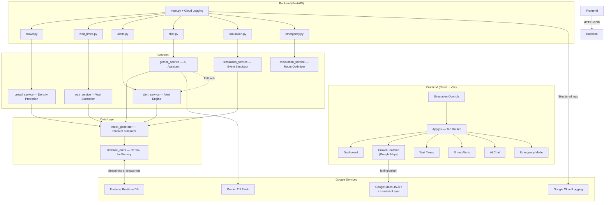
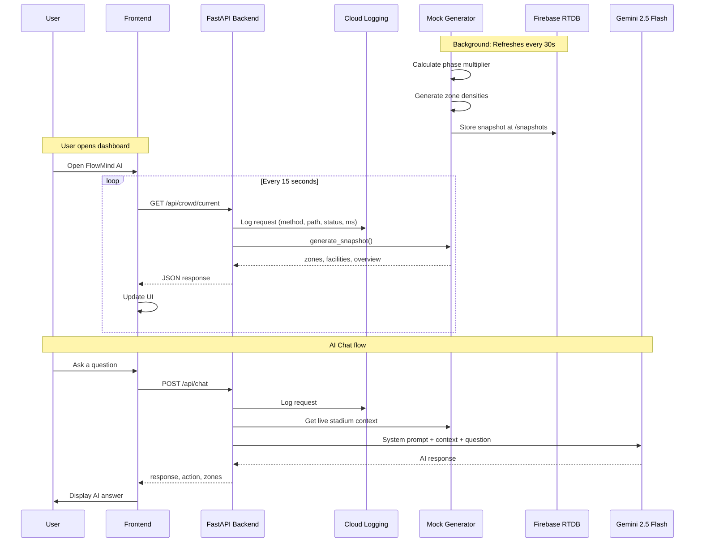
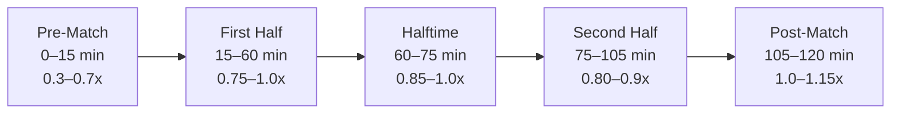

<div align="center">

# FlowMind AI

### Predictive Crowd Intelligence System for Sports Stadiums

*AI-powered crowd prediction | Real-time heatmaps | Wait time estimation | Smart navigation | Emergency evacuation*

[](https://python.org)
[](https://fastapi.tiangolo.com)
[](https://react.dev)
[](https://vite.dev)
[](https://ai.google.dev)
[](https://firebase.google.com)
[](https://cloud.google.com/run)
[](./backend/tests)
[](https://www.w3.org/WAI/WCAG21/quickref/)

</div>

---

## Problem Statement

Large sports stadiums hosting 50,000+ fans face critical challenges:

- **Crowd congestion** at gates, food courts, and restrooms causes frustration
- **Unpredictable wait times** lead to fans missing parts of the event
- **No real-time navigation** means fans can't find the fastest routes
- **Emergency evacuations** are slow without optimized gate routing

**FlowMind AI** solves this by providing **predictive crowd intelligence** — telling fans not just what's happening *now*, but what will happen in the **next 5 to 15 minutes**, visualized on a live Google Maps heatmap overlay.

---

## System Architecture



---

## Data Flow



---

## Event Simulation Timeline



The mock data engine uses **sine waves + Gaussian noise** applied to base zone densities, multiplied by a time-varying phase multiplier. Each zone oscillates independently, creating realistic crowd flow patterns.

```
density   = base_density × phase_multiplier + zone_wave + noise
wait_time = base_wait × (1 + density² × 3) + noise
```

---

## Project Structure

```
flowmind-ai/
├── README.md
├── .gitignore
│
├── backend/                              # FastAPI Python Backend
│   ├── app/
│   │   ├── main.py                       # App entry + Cloud Logging + CORS
│   │   ├── config.py                     # Pydantic settings (env loading)
│   │   │
│   │   ├── routers/                      # API endpoint handlers
│   │   │   ├── crowd.py                  # /api/crowd/* (3 endpoints)
│   │   │   ├── wait_times.py             # /api/wait-times/* (3 endpoints)
│   │   │   ├── alerts.py                 # /api/alerts/* (2 endpoints)
│   │   │   ├── chat.py                   # /api/chat (+ /languages)
│   │   │   ├── simulation.py             # /api/simulation/* (4 endpoints)
│   │   │   └── emergency.py              # /api/emergency/* (3 endpoints)
│   │   │
│   │   ├── services/                     # Business logic layer
│   │   │   ├── crowd_service.py          # Linear extrapolation predictions
│   │   │   ├── wait_service.py           # Facility ranking + best pick
│   │   │   ├── alert_service.py          # Threshold-based alert engine
│   │   │   ├── gemini_service.py         # Gemini AI + rule-based fallback
│   │   │   ├── simulation_service.py     # Event timeline controller
│   │   │   └── evacuation_service.py     # Optimal gate routing algorithm
│   │   │
│   │   ├── models/
│   │   │   └── schemas.py                # Pydantic request/response models
│   │   │
│   │   ├── data/
│   │   │   ├── mock_generator.py         # Time-varying stadium simulation
│   │   │   └── firebase_client.py        # Firebase RTDB + in-memory fallback
│   │   │
│   │   └── utils/
│   │       └── helpers.py                # Utility functions
│   │
│   ├── tests/
│   │   ├── conftest.py                   # Fixtures: TestClient, state reset, mocks
│   │   └── test_api.py                   # 123 tests across all endpoints
│   │
│   ├── requirements.txt
│   ├── Dockerfile
│   ├── .env.example                      # Template — copy to .env
│   └── start.bat                         # Windows quick-start script
│
└── frontend/                             # React + Vite Frontend
    ├── index.html                        # lang="en" + Google Maps script tag
    ├── package.json
    ├── vite.config.js
    ├── .env.example                      # Template — copy to .env.local
    │
    └── src/
        ├── main.jsx                      # React entry point
        ├── App.jsx                       # Tab router + skip-link + landmarks
        ├── index.css                     # Design system + WCAG focus styles
        │
        ├── components/
        │   ├── Layout/
        │   │   ├── Sidebar.jsx           # Arrow-key nav + aria-current
        │   │   ├── Header.jsx            # Live clock + aria-labels
        │   │   └── Layout.css
        │   │
        │   ├── Dashboard/
        │   │   ├── Dashboard.jsx         # Stats cards + zone grid (aria-live)
        │   │   └── Dashboard.css
        │   │
        │   ├── Heatmap/
        │   │   ├── CrowdHeatmap.jsx      # Google Maps or CSS fallback
        │   │   ├── GoogleMap.jsx         # Maps JS API + HeatmapLayer
        │   │   └── CrowdHeatmap.css
        │   │
        │   ├── WaitTimes/
        │   │   ├── WaitTimes.jsx         # Tablist + progressbar + aria-labels
        │   │   └── WaitTimes.css
        │   │
        │   ├── Alerts/
        │   │   ├── SmartAlerts.jsx       # role="feed" + aria-live
        │   │   └── SmartAlerts.css
        │   │
        │   ├── Chat/
        │   │   ├── AIChat.jsx            # role="log" + aria-busy
        │   │   └── AIChat.css
        │   │
        │   ├── Simulation/
        │   │   ├── SimulationControls.jsx  # progressbar + aria-live status
        │   │   └── SimulationControls.css
        │   │
        │   └── Emergency/
        │       ├── EmergencyMode.jsx     # role="alert" + progressbar
        │       └── EmergencyMode.css
        │
        ├── services/
        │   └── api.js                    # Centralized API client
        │
        ├── hooks/
        │   └── usePolling.js             # Auto-refresh hook
        │
        └── utils/
            └── constants.js              # Colors, labels, config
```

---

## Features

### 1. Real-Time Dashboard
- Live attendance counter and overall density percentage
- Zone-by-zone density cards with color-coded status: **Low** | **Moderate** | **High** | **Critical**
- Density progress bars with `role="progressbar"` and **15-minute prediction markers**
- Average wait times across food stalls, restrooms, and gates
- Quick insights panel showing busiest and quietest zones

### 2. Google Maps Crowd Heatmap
- **Real Google Maps** embedded with a `HeatmapLayer` overlay (requires API key)
- Heatmap data fed by `/api/crowd/heatmap` → lat/lng coordinates + density weights
- Custom dark map styling matching the app's design
- Gradient: green (low) → amber → orange → red (critical)
- Falls back to the original **CSS-grid stadium diagram** when no Maps key is set

### 3. Wait Time Tracker
- Filter by facility type: **Food Stalls** | **Restrooms** | **Gates** (accessible tablist with arrow-key nav)
- Each card shows current wait, queue length, and predicted trend
- **AI Best Pick** banner recommends the shortest-wait option with reasoning
- Color intensity scales with wait severity

### 4. Smart Alerts Engine
- Auto-generated alerts from crowd density and wait time thresholds
- Three severity levels: **Critical** | **Warning** | **Info**
- Each alert includes an **actionable recommendation**
- Rapid surge detection triggers alert on >15% density jump
- `role="feed"` with `aria-live="polite"` for real-time screen reader updates

### 5. AI Assistant (Gemini 2.5 Flash)
- Decision-focused responses with **live stadium context** injected
- **10 languages**: English, Hindi, Spanish, French, German, Portuguese, Arabic, Japanese, Chinese, Korean
- Quick-action buttons for the most common questions
- Works without API key via intelligent **rule-based fallback**
- `role="log"` message feed; `aria-live="assertive"` typing indicator

### 6. Live Event Simulation
- **Play / Pause / Speed** controls to fast-forward a full 120-minute match
- Speeds: 5x, 10x (demo), 20x (fast), 30x, 60x (ultra)
- Timeline `role="progressbar"` with 5 phase markers
- Visible on **all tabs** to watch how density, alerts, and wait times evolve

### 7. Emergency Evacuation System
- **One-click** emergency trigger with confirmation dialog
- AI calculates optimal **gate assignments per zone** based on proximity, gate throughput, and crowd count
- Gate load `role="progressbar"` distribution bars
- Zone exit assignment cards with estimated evacuation times
- `role="alert"` banner announced immediately by screen readers

### 8. Google Cloud Logging
- Every API request logged as structured JSON: `method`, `path`, `status_code`, `duration_ms`, `client`
- Logs appear in **Cloud Logging → Logs Explorer** on GCP when deployed
- Falls back to `logging.basicConfig()` locally — zero config required

### 9. Firebase Realtime Database
- Crowd snapshots written to `/snapshots` path in Firebase RTDB
- Uses **Application Default Credentials** — no JSON key file needed on Cloud Run
- Falls back to thread-safe **in-memory MockFirebaseDB** when `FIREBASE_DATABASE_URL` is not set
- Same `db.get/set/update/delete` interface — downstream code unchanged

### 10. WCAG 2.1 AA Accessibility
- **Skip navigation link** (visible on keyboard focus)
- All dynamic data regions use `aria-live="polite"` or `aria-live="assertive"`
- **Keyboard navigation**: arrow keys for sidebar tabs and filter tabs
- `role="progressbar"` on all density and wait bars
- `role="feed"` on the alerts list
- `role="log"` on the AI chat feed
- `role="alert"` on the emergency banner
- `focus-visible` outlines on all interactive elements
- Every interactive element has a descriptive `aria-label`
- `lang="en"` on `<html>`, `<main id="main-content">`, semantic `<section>/<article>/<nav>/<aside>`

---

## API Reference

### Crowd Intelligence

| Method | Endpoint | Description |
|--------|----------|-------------|
| `GET` | `/api/crowd/current` | Current zone densities, counts, statuses |
| `GET` | `/api/crowd/predict` | 5/10/15 min congestion forecasts per zone |
| `GET` | `/api/crowd/heatmap` | Lat/lng/weight data for Google Maps HeatmapLayer |

### Wait Times

| Method | Endpoint | Description |
|--------|----------|-------------|
| `GET` | `/api/wait-times` | All facility wait times and queue lengths |
| `GET` | `/api/wait-times/best/{type}` | AI-recommended best facility of given type |
| `GET` | `/api/wait-times/{id}/predict` | Facility-specific wait time prediction |

### Smart Alerts

| Method | Endpoint | Description |
|--------|----------|-------------|
| `GET` | `/api/alerts` | Active alerts sorted by severity |
| `GET` | `/api/alerts/history` | Recent alert history |

### AI Chat

| Method | Endpoint | Description |
|--------|----------|-------------|
| `POST` | `/api/chat` | Send message and receive AI response |
| `GET` | `/api/chat/languages` | List of 10 supported languages |

### Event Simulation

| Method | Endpoint | Description |
|--------|----------|-------------|
| `GET` | `/api/simulation/status` | Current simulation state and phase |
| `POST` | `/api/simulation/start` | Start simulation with speed setting |
| `POST` | `/api/simulation/stop` | Stop and reset simulation |
| `POST` | `/api/simulation/speed` | Change speed while running |

### Emergency

| Method | Endpoint | Description |
|--------|----------|-------------|
| `POST` | `/api/emergency/evacuate` | Trigger evacuation and calculate routes |
| `POST` | `/api/emergency/cancel` | Cancel active evacuation |
| `GET` | `/api/emergency/status` | Get current evacuation plan |

---

## Quick Start

### Prerequisites

| Tool | Version | Purpose |
|------|---------|---------|
| Python | 3.10+ | Backend runtime |
| Node.js | 18+ | Frontend runtime |
| npm | 9+ | Package manager |
| Gemini API Key | Optional | AI chat (rule-based fallback if missing) |
| Google Maps API Key | Optional | Live heatmap (CSS fallback if missing) |
| Firebase Project | Optional | Persistent storage (in-memory fallback if missing) |

### Step 1: Clone the Repository

```bash
git clone https://github.com/dpkpaswan/flowmind-ai.git
cd flowmind-ai
```

### Step 2: Configure the Backend

```bash
cd backend

# Install dependencies
pip install -r requirements.txt

# Configure environment
cp .env.example .env
# Edit .env and fill in your values (all optional — app works with defaults)
```

### Step 3: Start the Backend

```bash
python -m uvicorn app.main:app --reload --port 8000
```

Verify at **http://localhost:8000/docs** → Swagger UI with all 17 endpoints.

### Step 4: Configure the Frontend

```bash
cd frontend

# Install dependencies
npm install

# Configure environment
cp .env.example .env.local
# Edit .env.local — add VITE_GOOGLE_MAPS_API_KEY to enable live heatmap
```

### Step 5: Start the Frontend

```bash
npm run dev
```

Open **http://localhost:5173** in your browser.

---

## Configuration

### Backend (`backend/.env`)

| Variable | Default | Description |
|----------|---------|-------------|
| `GEMINI_API_KEY` | *(empty)* | From [AI Studio](https://aistudio.google.com/apikey) — fallback used if empty |
| `GEMINI_MODEL` | `gemini-2.5-flash` | Gemini model identifier |
| `FIREBASE_DATABASE_URL` | *(empty)* | Firebase RTDB URL — in-memory mock used if empty |
| `GOOGLE_CLOUD_PROJECT` | *(empty)* | GCP project ID for Cloud Logging |
| `GOOGLE_MAPS_API_KEY` | *(empty)* | Stored here for reference; used by frontend |
| `CORS_ORIGINS` | `localhost:5173,3000` | Comma-separated allowed frontend origins |
| `STADIUM_NAME` | `MetaStadium Arena` | Stadium display name |
| `STADIUM_CAPACITY` | `60000` | Total stadium capacity |
| `MOCK_UPDATE_INTERVAL` | `30` | Data refresh interval in seconds |
| `DENSITY_WARNING_THRESHOLD` | `0.75` | Alert triggers at 75% density |
| `DENSITY_CRITICAL_THRESHOLD` | `0.90` | Critical alert at 90% density |

### Frontend (`frontend/.env.local`)

| Variable | Default | Description |
|----------|---------|-------------|
| `VITE_API_URL` | `http://localhost:8000` | Backend API base URL |
| `VITE_GOOGLE_MAPS_API_KEY` | *(empty)* | Enable **Maps JavaScript API** + **Visualization library** in GCP console |

> **Security note:** `.env`, `.env.local`, and `.env.production` are all gitignored. Never commit files containing real API keys.

---

## Testing

The backend has a comprehensive pytest suite with **123 tests** covering all API endpoints.

```bash
cd backend
python -m pytest tests/test_api.py -v
```

```
123 passed in ~35s ✅
```

### Test Coverage

| Test Class | Endpoint(s) | Tests |
|------------|-------------|-------|
| `TestHealthCheck` | `GET /` | 3 |
| `TestCrowdCurrent` | `GET /api/crowd/current` | 10 |
| `TestCrowdPredict` | `GET /api/crowd/predict` | 6 |
| `TestCrowdHeatmap` | `GET /api/crowd/heatmap` | 6 |
| `TestWaitTimes` | `GET /api/wait-times` | 7 |
| `TestWaitTimesBestAlternative` | `GET /api/wait-times/best/{type}` | 6 |
| `TestWaitTimesFacilityPredict` | `GET /api/wait-times/{id}/predict` | 7 |
| `TestAlerts` + `TestAlertHistory` | `GET /api/alerts` | 9 |
| `TestChat` + `TestChatLanguages` | `POST /api/chat` | 18 |
| `TestSimulation*` (4 classes) | simulation endpoints | 19 |
| `TestEmergency*` (3 classes) | emergency endpoints | 12 |
| `TestEdgeCases` | 404, 405, 422, concurrency | 10 |

---

## Google Services Integration

### Google Maps Heatmap
1. Go to [GCP Console](https://console.cloud.google.com) → APIs & Services
2. Enable **Maps JavaScript API** and **Visualization library**
3. Create an API key → add to `frontend/.env.local` as `VITE_GOOGLE_MAPS_API_KEY`
4. Restart the dev server — the heatmap page will now show a live map

### Firebase Realtime Database
1. Create a project at [firebase.google.com](https://firebase.google.com)
2. Enable **Realtime Database** in test mode
3. Add the database URL to `backend/.env` as `FIREBASE_DATABASE_URL`
4. On Cloud Run: ADC handles auth automatically — no service account JSON needed

### Google Cloud Logging
1. Enable **Cloud Logging API** in your GCP project
2. Set `GOOGLE_CLOUD_PROJECT=your-project-id` in `backend/.env`
3. On Cloud Run: logs appear automatically in **Logs Explorer**
4. Locally: falls back to standard `logging.basicConfig()`

---

## Stadium Layout

The simulated stadium has **8 zones** and **13 facilities**:

| Zone | Capacity | Type |
|------|----------|------|
| North Stand | 12,000 | Seating |
| South Stand | 12,000 | Seating |
| East Stand | 10,000 | Seating |
| West Stand | 10,000 | Seating |
| Food Court A | 3,000 | Concessions |
| Food Court B | 3,000 | Concessions |
| Main Gate | 5,000 | Entry/Exit |
| VIP Lounge | 2,000 | Premium |

**Facilities**: 5 food stalls, 4 restrooms, 4 gates (Main, North, South, VIP)

---

## Docker / Cloud Run Deployment

```bash
# Backend
cd backend
docker build -t flowmind-backend .
docker run -p 8000:8000 \
  -e GEMINI_API_KEY=your-key \
  -e FIREBASE_DATABASE_URL=your-rtdb-url \
  -e GOOGLE_CLOUD_PROJECT=your-project \
  flowmind-backend

# Frontend (production build)
cd frontend
# Set VITE_GOOGLE_MAPS_API_KEY in .env.production first
npm run build
# Serve the dist/ folder with any static server or Cloud Run
```

**Live deployment:** `https://flowmind-backend-817820730147.us-central1.run.app`

---

## Tech Stack

| Layer | Technology | Purpose |
|-------|-----------|---------|
| Backend | FastAPI 0.115 | Async Python, auto OpenAPI docs |
| Frontend | React 19 + Vite 8 | Fast HMR, modern JSX |
| AI | Gemini 2.5 Flash | Crowd intelligence assistant |
| Maps | Google Maps JS API | Live heatmap visualization |
| Database | Firebase Realtime DB | Crowd snapshot persistence |
| Logging | Google Cloud Logging | Structured request telemetry |
| Styling | Vanilla CSS | Full control, zero framework overhead |
| State | React hooks + polling | Simple, no Redux complexity |
| Config | Pydantic Settings | Type-safe, env-validated |
| Testing | pytest + httpx | 123 API endpoint tests |
| Accessibility | WCAG 2.1 AA | Screen reader & keyboard support |
| Deployment | Docker + Cloud Run | Portable, serverless scaling |

---

## License

MIT License — Free for personal and commercial use.

---

<div align="center">

**Built by [@dpkpaswan](https://github.com/dpkpaswan)**

</div>
