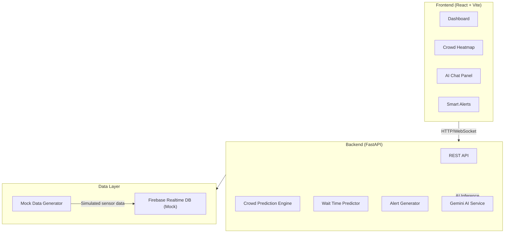

# FlowMind AI — Predictive Crowd Intelligence System

A real-time crowd intelligence platform for large sports stadiums that predicts congestion, reduces wait times, and provides AI-powered navigation assistance.

## Architecture Overview



## Folder Structure

```
PromptWars/
├── backend/
│   ├── app/
│   │   ├── __init__.py
│   │   ├── main.py                  # FastAPI app entry point
│   │   ├── config.py                # Settings & environment config
│   │   ├── routers/
│   │   │   ├── __init__.py
│   │   │   ├── crowd.py             # Crowd prediction endpoints
│   │   │   ├── wait_times.py        # Wait time prediction endpoints
│   │   │   ├── alerts.py            # Smart alert endpoints
│   │   │   └── chat.py              # Gemini AI chat endpoints
│   │   ├── services/
│   │   │   ├── __init__.py
│   │   │   ├── crowd_service.py     # Crowd prediction logic
│   │   │   ├── wait_service.py      # Wait time estimation logic
│   │   │   ├── alert_service.py     # Alert generation logic
│   │   │   └── gemini_service.py    # Gemini Flash API integration
│   │   ├── models/
│   │   │   ├── __init__.py
│   │   │   └── schemas.py           # Pydantic request/response models
│   │   ├── data/
│   │   │   ├── __init__.py
│   │   │   ├── mock_generator.py    # Mock stadium data generator
│   │   │   └── firebase_client.py   # Firebase Realtime DB client (mock)
│   │   └── utils/
│   │       ├── __init__.py
│   │       └── helpers.py           # Utility functions
│   ├── requirements.txt
│   ├── Dockerfile
│   └── .env.example
├── frontend/
│   ├── public/
│   ├── src/
│   │   ├── components/
│   │   │   ├── Dashboard/
│   │   │   │   ├── Dashboard.jsx
│   │   │   │   └── Dashboard.css
│   │   │   ├── Heatmap/
│   │   │   │   ├── CrowdHeatmap.jsx
│   │   │   │   └── CrowdHeatmap.css
│   │   │   ├── Chat/
│   │   │   │   ├── AIChat.jsx
│   │   │   │   └── AIChat.css
│   │   │   ├── Alerts/
│   │   │   │   ├── SmartAlerts.jsx
│   │   │   │   └── SmartAlerts.css
│   │   │   ├── WaitTimes/
│   │   │   │   ├── WaitTimes.jsx
│   │   │   │   └── WaitTimes.css
│   │   │   └── Layout/
│   │   │       ├── Sidebar.jsx
│   │   │       ├── Header.jsx
│   │   │       └── Layout.css
│   │   ├── services/
│   │   │   └── api.js                # API client
│   │   ├── hooks/
│   │   │   └── usePolling.js         # Polling hook for real-time updates
│   │   ├── utils/
│   │   │   └── constants.js          # App-wide constants
│   │   ├── App.jsx
│   │   ├── App.css
│   │   ├── index.css                 # Global design system
│   │   └── main.jsx
│   ├── index.html
│   ├── package.json
│   ├── vite.config.js
│   └── Dockerfile
├── docker-compose.yml
└── README.md
```

## Proposed Changes

### Phase 1: Backend Foundation (Current Scope)

---

### Backend — Core Setup

#### [NEW] [requirements.txt](file:///c:/Users/Deepak Paswan/Desktop/PromptWars/backend/requirements.txt)
- FastAPI, uvicorn, pydantic, python-dotenv
- google-generativeai (Gemini SDK)
- firebase-admin (mock mode)
- httpx for async HTTP

#### [NEW] [config.py](file:///c:/Users/Deepak Paswan/Desktop/PromptWars/backend/app/config.py)
- Pydantic `Settings` class with env var loading
- Gemini API key, Firebase config, CORS origins

#### [NEW] [main.py](file:///c:/Users/Deepak Paswan/Desktop/PromptWars/backend/app/main.py)
- FastAPI app with CORS middleware
- Router registration for all endpoints
- Lifespan handler to initialize mock data on startup

---

### Backend — Data Models

#### [NEW] [schemas.py](file:///c:/Users/Deepak Paswan/Desktop/PromptWars/backend/app/models/schemas.py)
- `ZoneData` — zone id, name, current density, predicted density, coordinates
- `WaitTimeData` — facility id, name, type (food/restroom/gate), current wait, predicted wait
- `Alert` — severity, message, zone, timestamp, action recommendation
- `ChatMessage` / `ChatResponse` — user query + AI response with context
- `CrowdPrediction` — zone-level 10–15 min forecast
- `StadiumOverview` — aggregate stats for the dashboard

---

### Backend — Mock Data Layer

#### [NEW] [mock_generator.py](file:///c:/Users/Deepak Paswan/Desktop/PromptWars/backend/app/data/mock_generator.py)
- Generates realistic stadium layout: 8 zones (North Stand, South Stand, East Stand, West Stand, Food Court A/B, Main Gate, VIP Lounge)
- Time-varying crowd density simulation (sine wave + noise to mimic event flow)
- Food stall, restroom, and gate wait times with realistic distributions
- Updates every 30 seconds to simulate real sensor data

#### [NEW] [firebase_client.py](file:///c:/Users/Deepak Paswan/Desktop/PromptWars/backend/app/data/firebase_client.py)
- In-memory mock Firebase client (dict-based)
- Same interface as Firebase Realtime DB (get/set/listen)
- Can swap to real Firebase with one config change

---

### Backend — Services

#### [NEW] [crowd_service.py](file:///c:/Users/Deepak Paswan/Desktop/PromptWars/backend/app/services/crowd_service.py)
- `get_current_density()` — returns all zone densities
- `predict_congestion(zone_id, minutes_ahead)` — simple linear regression + trend analysis on recent data points to predict 10–15 min congestion
- `get_heatmap_data()` — returns coordinate-based density data for map overlay

#### [NEW] [wait_service.py](file:///c:/Users/Deepak Paswan/Desktop/PromptWars/backend/app/services/wait_service.py)
- `get_wait_times()` — current wait for all facilities
- `predict_wait(facility_id, minutes_ahead)` — estimated future wait time
- `get_best_alternative(facility_type)` — recommends least-crowded option

#### [NEW] [alert_service.py](file:///c:/Users/Deepak Paswan/Desktop/PromptWars/backend/app/services/alert_service.py)
- `generate_alerts()` — scans crowd + wait data, produces actionable alerts
- Thresholds: density > 80% = warning, > 90% = critical
- "Leave now" alerts when crowd trends predict surge in 10 min

#### [NEW] [gemini_service.py](file:///c:/Users/Deepak Paswan/Desktop/PromptWars/backend/app/services/gemini_service.py)
- Initializes Gemini Flash model with stadium-context system prompt
- System prompt includes: stadium layout, current crowd state, wait times, active alerts
- `ask_assistant(user_query)` — enriches query with live data context, sends to Gemini, returns decision-focused response (not generic chatbot replies)
- Response formatting: structured with recommended action, reasoning, and confidence

---

### Backend — API Routers

#### [NEW] [crowd.py](file:///c:/Users/Deepak Paswan/Desktop/PromptWars/backend/app/routers/crowd.py)
- `GET /api/crowd/current` — current zone densities
- `GET /api/crowd/predict` — 10–15 min prediction for all zones
- `GET /api/crowd/heatmap` — heatmap-ready data with coordinates

#### [NEW] [wait_times.py](file:///c:/Users/Deepak Paswan/Desktop/PromptWars/backend/app/routers/wait_times.py)
- `GET /api/wait-times` — all facility wait times
- `GET /api/wait-times/{facility_id}/predict` — predicted wait for specific facility
- `GET /api/wait-times/best/{facility_type}` — best alternative

#### [NEW] [alerts.py](file:///c:/Users/Deepak Paswan/Desktop/PromptWars/backend/app/routers/alerts.py)
- `GET /api/alerts` — current active alerts
- `GET /api/alerts/history` — recent alert history

#### [NEW] [chat.py](file:///c:/Users/Deepak Paswan/Desktop/PromptWars/backend/app/routers/chat.py)
- `POST /api/chat` — send question, get AI-powered answer with stadium context

---

### Phase 2: Frontend (Next Step)

> [!NOTE]
> Frontend will be built after backend is solid. Will include:
> - Dashboard with live crowd heatmap (Google Maps JS API)
> - AI Chat panel with decision-focused responses
> - Wait time cards with predictions
> - Smart alert notifications
> - Dark-themed, glassmorphic UI

### Phase 3: Deployment (Final Step)

> [!NOTE]
> Dockerization and Cloud Run setup will be done last:
> - Multi-stage Dockerfiles for both services
> - docker-compose.yml for local dev
> - Cloud Run deployment configs

## Design Decisions

| Decision | Rationale |
|---|---|
| In-memory mock Firebase | Eliminates external dependency for development; swappable interface |
| Sine-wave crowd simulation | Mimics realistic event flow (pre-match buildup → halftime → exit) |
| Gemini with live context injection | Makes AI responses decision-specific, not generic |
| Simple linear trend for predictions | Lightweight, no ML training needed; good enough for 10–15 min window |
| Polling-based updates (not WebSocket) | Simpler to implement; 30s polling is fine for crowd data refresh rates |

## Verification Plan

### Phase 1 Verification
- **Backend starts**: `uvicorn app.main:app --reload` runs without errors
- **API docs**: Swagger UI at `/docs` shows all endpoints
- **Mock data**: `/api/crowd/current` returns realistic zone densities
- **Predictions**: `/api/crowd/predict` returns future density that differs from current
- **Gemini integration**: `/api/chat` returns contextual AI response (requires valid API key)
- **Alerts**: `/api/alerts` returns alerts when density is high

### Manual Testing
- Hit each endpoint via Swagger UI / curl
- Verify response schemas match Pydantic models
- Confirm mock data varies over time (multiple calls show different values)
